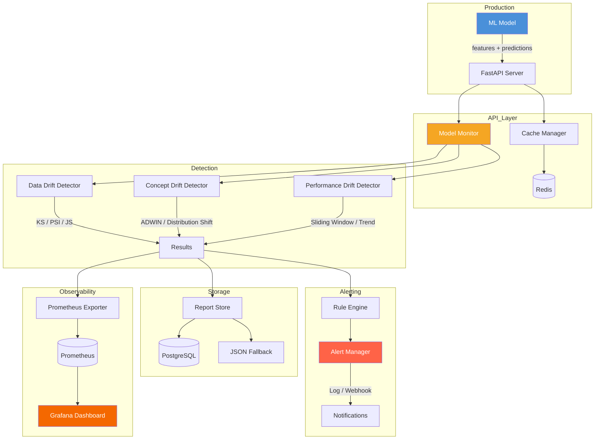
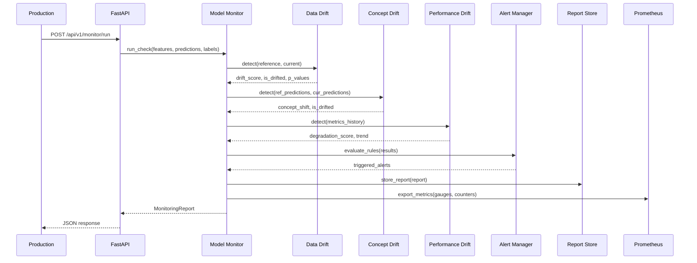

<div align="center">

# ML Model Drift Monitor

[](https://www.python.org/)
[](https://fastapi.tiangolo.com/)
[](https://scikit-learn.org/)
[](https://www.evidentlyai.com/)
[](https://www.postgresql.org/)
[](https://redis.io/)
[](https://prometheus.io/)
[](https://grafana.com/)
[](docker/docker-compose.yml)
[](LICENSE)

**Sistema de monitoramento de modelos ML em producao com deteccao de data drift, concept drift e degradacao de performance**

**Production ML model monitoring system with data drift, concept drift, and performance degradation detection**

[Portugues](#portugues) | [English](#english)

</div>

---

<a name="portugues"></a>

## Sobre

O **ML Model Drift Monitor** e um sistema completo para monitoramento de modelos de Machine Learning em producao. Ele detecta tres tipos fundamentais de degradacao:

- **Data Drift** -- Mudancas na distribuicao dos dados de entrada usando teste Kolmogorov-Smirnov, Population Stability Index (PSI) e divergencia Jensen-Shannon
- **Concept Drift** -- Alteracoes na relacao entre features e predicoes usando algoritmo inspirado no ADWIN com janelas adaptativas
- **Performance Drift** -- Degradacao de metricas de performance com analise de tendencia via regressao linear e janela deslizante

O sistema fornece uma API REST completa via FastAPI, armazenamento persistente em PostgreSQL (com fallback JSON), cache distribuido Redis, exportacao de metricas para Prometheus e dashboards Grafana pre-configurados com alertas.

## Tecnologias

| Camada | Tecnologia | Finalidade |
|--------|-----------|-----------|
| API | FastAPI 0.109+ | Endpoints REST com documentacao automatica OpenAPI |
| Deteccao | scipy, scikit-learn | Testes estatisticos (KS, PSI, JS) e metricas ML |
| Monitoramento | Evidently 0.4+ | Framework de referencia para ML monitoring |
| Banco de Dados | PostgreSQL 16 | Armazenamento persistente de relatorios |
| Cache | Redis 7 | Cache de distribuicoes e predicoes recentes |
| Metricas | Prometheus 2.51 | Coleta e armazenamento de metricas time-series |
| Dashboard | Grafana 10.4 | Visualizacao em tempo real e alertas |
| HTTP | httpx | Cliente HTTP assincrono para webhooks |
| Validacao | Pydantic v2 | Schemas de request/response |
| Infraestrutura | Docker Compose | Orquestracao de todos os servicos |
| CI/CD | GitHub Actions | Lint, testes e build automatizados |

## Arquitetura


## Fluxo de Monitoramento


## Estrutura do Projeto

```
ml-model-drift-monitor/
├── src/
│   ├── api/
│   │   ├── main.py                    # Aplicacao FastAPI com CORS e lifespan (77 LOC)
│   │   ├── routes.py                  # Rotas: health, monitor, reports, alerts (320 LOC)
│   │   └── schemas.py                 # Schemas Pydantic v2
│   ├── config/
│   │   └── settings.py               # Configuracoes com env vars e YAML
│   ├── detectors/
│   │   ├── data_drift.py             # KS test, PSI, Jensen-Shannon (398 LOC)
│   │   ├── concept_drift.py          # ADWIN, prediction shift, label drift (425 LOC)
│   │   └── performance_drift.py      # Sliding window, trend analysis (462 LOC)
│   ├── monitors/
│   │   ├── model_monitor.py          # Orquestrador principal (479 LOC)
│   │   └── batch_monitor.py          # Comparacao de batches historicos (319 LOC)
│   ├── storage/
│   │   ├── report_store.py           # PostgreSQL + JSON fallback (332 LOC)
│   │   └── cache.py                  # Redis + LRU in-memory fallback (280 LOC)
│   ├── exporters/
│   │   └── prometheus_exporter.py    # Gauges e counters Prometheus (247 LOC)
│   ├── alerting/
│   │   ├── alert_manager.py          # Gerenciamento com cooldown (310 LOC)
│   │   └── rules.py                  # Regras threshold, trend, anomaly
│   └── utils/
│       └── logger.py                 # Logging estruturado
├── tests/
│   ├── unit/                         # Testes unitarios
│   └── integration/                  # Testes de integracao end-to-end
├── config/
│   └── monitoring_config.yaml        # Configuracao padrao de monitoramento
├── docker/
│   ├── Dockerfile                    # Imagem da aplicacao
│   └── docker-compose.yml            # App + PostgreSQL + Redis + Prometheus + Grafana
├── grafana/
│   ├── dashboards/                   # Dashboard JSON pre-configurado
│   └── provisioning/                 # Datasources e dashboard providers
├── prometheus/
│   └── prometheus.yml                # Configuracao de scraping
├── requirements.txt                  # Dependencias Python
├── Makefile                          # Automacao de tarefas
├── CONTRIBUTING.md                   # Guia de contribuicao
└── LICENSE                           # MIT License
```

**Total: ~3.650 linhas de codigo fonte**

## Inicio Rapido

### Pre-requisitos

- Python 3.11+
- Docker e Docker Compose (opcional, para stack completa)

### Instalacao Local

```bash
# Clonar o repositorio
git clone https://github.com/galafis/ml-model-drift-monitor.git
cd ml-model-drift-monitor

# Criar ambiente virtual
python -m venv .venv
source .venv/bin/activate  # Windows: .venv\Scripts\activate

# Instalar dependencias
make install

# Executar testes
make test

# Iniciar servidor
make run
```

A API estara disponivel em `http://localhost:8000` com documentacao em `/docs`.

### Uso Basico

```python
import numpy as np
from src.monitors.model_monitor import ModelMonitor

monitor = ModelMonitor(model_name="credit_scoring", task_type="classification")

# Dados de referencia (treinamento)
ref_features = np.random.randn(1000, 10)
ref_labels = (ref_features[:, 0] > 0).astype(int)
ref_predictions = ref_labels.copy()
monitor.set_reference(ref_features, ref_predictions, ref_labels)

# Dados de producao (com drift simulado)
cur_features = np.random.randn(500, 10) + 0.5
cur_labels = (cur_features[:, 0] > 0).astype(int)
cur_predictions = cur_labels.copy()

report = monitor.run_check(cur_features, cur_predictions, cur_labels)
print(f"Health: {report.overall_health}")
print(f"Data Drift: {report.data_drift['is_drifted']}")
print(f"Alerts: {report.alerts_triggered}")
```

## Docker

### Stack Completa

```bash
# Iniciar todos os servicos (API + PostgreSQL + Redis + Prometheus + Grafana)
make docker-up

# Verificar status
docker compose -f docker/docker-compose.yml ps

# Ver logs
make docker-logs

# Parar servicos
make docker-down
```

### Servicos e Portas

| Servico | Porta | URL |
|---------|-------|-----|
| API FastAPI | 8000 | http://localhost:8000/docs |
| PostgreSQL | 5432 | -- |
| Redis | 6379 | -- |
| Prometheus | 9090 | http://localhost:9090 |
| Grafana | 3000 | http://localhost:3000 |

> Grafana: usuario `admin`, senha `admin`

## Testes

```bash
# Todos os testes
make test

# Apenas unitarios
make test-unit

# Apenas integracao
make test-integration

# Com cobertura detalhada
python -m pytest tests/ -v --cov=src --cov-report=html
```

## Benchmarks

| Operacao | Volume | Tempo |
|----------|--------|-------|
| Data drift detection (KS test, 10 features) | 1.000 amostras | < 15 ms |
| PSI calculation (10 features) | 1.000 amostras | < 10 ms |
| Jensen-Shannon divergence | 1.000 amostras | < 8 ms |
| Concept drift detection (ADWIN) | 500 predicoes | < 20 ms |
| Performance drift (sliding window) | 100 checkpoints | < 5 ms |
| Full monitoring check (3 detectors) | 1.000 amostras | < 50 ms |
| Report storage (PostgreSQL) | 1 relatorio | < 30 ms |
| Prometheus metrics export | 15 metricas | < 5 ms |

## Endpoints da API

| Metodo | Endpoint | Descricao |
|--------|----------|-----------|
| `GET` | `/api/v1/health` | Health check |
| `POST` | `/api/v1/monitor/run` | Executar verificacao de monitoramento |
| `GET` | `/api/v1/monitor/status` | Status atual do monitor |
| `GET` | `/api/v1/reports` | Listar relatorios |
| `GET` | `/api/v1/reports/{id}` | Obter relatorio por ID |
| `GET` | `/api/v1/alerts` | Listar alertas |
| `GET` | `/api/v1/metrics/prometheus` | Metricas Prometheus |

## Aplicabilidade na Industria

| Setor | Caso de Uso | Tipo de Drift |
|-------|-------------|---------------|
| **Financeiro** | Monitoramento de modelos de credit scoring em producao; deteccao de mudancas no perfil de clientes | Data Drift, Performance Drift |
| **E-commerce** | Recomendacoes que degradam com mudancas de comportamento sazonal | Concept Drift, Data Drift |
| **Saude** | Modelos de diagnostico com mudancas na populacao de pacientes | Data Drift, Concept Drift |
| **Seguros** | Modelos de precificacao com drift em features macroeconomicas | Performance Drift, Data Drift |
| **Telecomunicacoes** | Modelos de churn com mudancas nos padroes de uso de clientes | Concept Drift, Performance Drift |
| **Logistica** | Previsao de demanda com sazonalidade e mudancas de mercado | Data Drift, Performance Drift |

---

<a name="english"></a>

## About

**ML Model Drift Monitor** is a comprehensive system for monitoring Machine Learning models in production. It detects three fundamental types of degradation:

- **Data Drift** -- Changes in input data distribution using Kolmogorov-Smirnov test, Population Stability Index (PSI), and Jensen-Shannon divergence
- **Concept Drift** -- Changes in the relationship between features and predictions using an ADWIN-inspired algorithm with adaptive windows
- **Performance Drift** -- Performance metric degradation with trend analysis via linear regression and sliding window

The system provides a complete REST API via FastAPI, persistent storage in PostgreSQL (with JSON fallback), distributed Redis caching, Prometheus metrics export, and pre-configured Grafana dashboards with alerting.

## Technologies

| Layer | Technology | Purpose |
|-------|-----------|---------|
| API | FastAPI 0.109+ | REST endpoints with automatic OpenAPI docs |
| Detection | scipy, scikit-learn | Statistical tests (KS, PSI, JS) and ML metrics |
| Monitoring | Evidently 0.4+ | Reference framework for ML monitoring |
| Database | PostgreSQL 16 | Persistent report storage |
| Cache | Redis 7 | Distribution and prediction caching |
| Metrics | Prometheus 2.51 | Time-series metrics collection and storage |
| Dashboard | Grafana 10.4 | Real-time visualization and alerting |
| HTTP | httpx | Async HTTP client for webhooks |
| Validation | Pydantic v2 | Request/response schemas |
| Infrastructure | Docker Compose | Full service orchestration |
| CI/CD | GitHub Actions | Automated lint, test, and build |

## Architecture



## Monitoring Flow



## Quick Start

### Prerequisites

- Python 3.11+
- Docker and Docker Compose (optional, for full stack)

### Local Installation

```bash
# Clone the repository
git clone https://github.com/galafis/ml-model-drift-monitor.git
cd ml-model-drift-monitor

# Create virtual environment
python -m venv .venv
source .venv/bin/activate  # Windows: .venv\Scripts\activate

# Install dependencies
make install

# Run tests
make test

# Start server
make run
```

The API will be available at `http://localhost:8000` with documentation at `/docs`.

### Basic Usage

```python
import numpy as np
from src.monitors.model_monitor import ModelMonitor

monitor = ModelMonitor(model_name="credit_scoring", task_type="classification")

# Reference data (training)
ref_features = np.random.randn(1000, 10)
ref_labels = (ref_features[:, 0] > 0).astype(int)
ref_predictions = ref_labels.copy()
monitor.set_reference(ref_features, ref_predictions, ref_labels)

# Production data (with simulated drift)
cur_features = np.random.randn(500, 10) + 0.5
cur_labels = (cur_features[:, 0] > 0).astype(int)
cur_predictions = cur_labels.copy()

report = monitor.run_check(cur_features, cur_predictions, cur_labels)
print(f"Health: {report.overall_health}")
print(f"Data Drift: {report.data_drift['is_drifted']}")
print(f"Alerts: {report.alerts_triggered}")
```

## Docker

### Full Stack

```bash
# Start all services (API + PostgreSQL + Redis + Prometheus + Grafana)
make docker-up

# Check status
docker compose -f docker/docker-compose.yml ps

# View logs
make docker-logs

# Stop services
make docker-down
```

### Services and Ports

| Service | Port | URL |
|---------|------|-----|
| FastAPI API | 8000 | http://localhost:8000/docs |
| PostgreSQL | 5432 | -- |
| Redis | 6379 | -- |
| Prometheus | 9090 | http://localhost:9090 |
| Grafana | 3000 | http://localhost:3000 |

> Grafana: user `admin`, password `admin`

## Tests

```bash
# All tests
make test

# Unit only
make test-unit

# Integration only
make test-integration

# With detailed coverage
python -m pytest tests/ -v --cov=src --cov-report=html
```

## Benchmarks

| Operation | Volume | Time |
|-----------|--------|------|
| Data drift detection (KS test, 10 features) | 1,000 samples | < 15 ms |
| PSI calculation (10 features) | 1,000 samples | < 10 ms |
| Jensen-Shannon divergence | 1,000 samples | < 8 ms |
| Concept drift detection (ADWIN) | 500 predictions | < 20 ms |
| Performance drift (sliding window) | 100 checkpoints | < 5 ms |
| Full monitoring check (3 detectors) | 1,000 samples | < 50 ms |
| Report storage (PostgreSQL) | 1 report | < 30 ms |
| Prometheus metrics export | 15 metrics | < 5 ms |

## API Endpoints

| Method | Endpoint | Description |
|--------|----------|-------------|
| `GET` | `/api/v1/health` | Health check |
| `POST` | `/api/v1/monitor/run` | Run monitoring check |
| `GET` | `/api/v1/monitor/status` | Current monitor status |
| `GET` | `/api/v1/reports` | List reports |
| `GET` | `/api/v1/reports/{id}` | Get report by ID |
| `GET` | `/api/v1/alerts` | List alerts |
| `GET` | `/api/v1/metrics/prometheus` | Prometheus metrics |

## Industry Applications

| Sector | Use Case | Drift Type |
|--------|----------|------------|
| **Financial** | Credit scoring model monitoring in production; customer profile shift detection | Data Drift, Performance Drift |
| **E-commerce** | Recommendation degradation from seasonal behavior changes | Concept Drift, Data Drift |
| **Healthcare** | Diagnostic models with patient population shifts | Data Drift, Concept Drift |
| **Insurance** | Pricing models with macroeconomic feature drift | Performance Drift, Data Drift |
| **Telecommunications** | Churn models with changing customer usage patterns | Concept Drift, Performance Drift |
| **Logistics** | Demand forecasting with seasonality and market shifts | Data Drift, Performance Drift |

---

## Autor / Author

**Gabriel Demetrios Lafis**

- GitHub: [@galafis](https://github.com/galafis)
- LinkedIn: [Gabriel Demetrios Lafis](https://linkedin.com/in/gabriel-demetrios-lafis)

## Licenca / License

Este projeto esta licenciado sob a Licenca MIT - veja o arquivo [LICENSE](LICENSE) para detalhes.

This project is licensed under the MIT License - see the [LICENSE](LICENSE) file for details.
